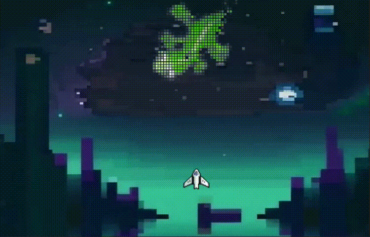
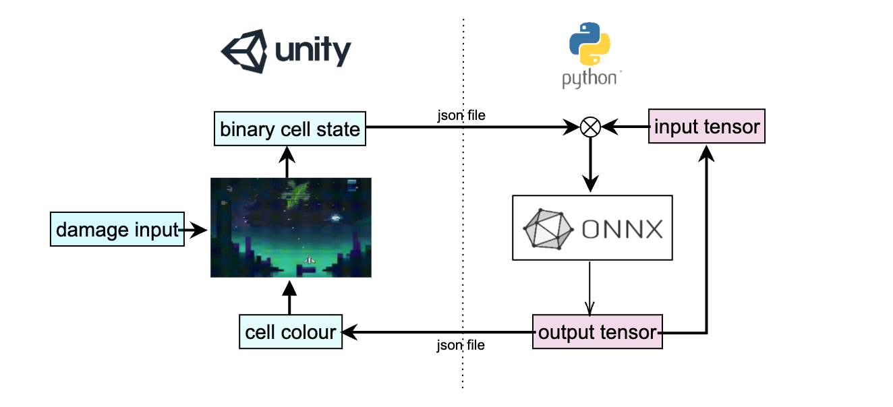

# GNCA_invader

## GNCA Invader Game
  
This game is presented at the ALIFE 2023 workshop. 
As a preliminary implementation of GNCA to video games, Python was used for running neural network models, and Unity for running the game. The implemented game here is inspired by the classic Space Invaders from 1978. In the original game, space fighters shoot aliens. We replaced aliens with a GNCA lizard and the player aims to defeat the lizard by eliminating all its cells. The game was developed by `Takahide Yoshida` and `Hiroki Sato`. For more information, see `Automata Quest: NCAs as a Video Game Life Mechanic` by Hiroki Sato,　`Tanner Lund`, and Takahide Yoshida.

## Architecture
  
 With regards to the Python code, we used a GNCA model with 16 channels per cell trained on PyTorch and converted to ONNX. The Python program receives an input of an array of binary cell state (0 = dead, 1 = alive) on the game engine and applies it to the cell 16-channel states. The GNCA model infers the cells and outputs updated cell states. On the game engine (Unity) side, the engine reads the RGBα channels of the updated cell state and depicts alive cells as cubes with a color specified by the json files. The cell cubes are broken on collision with bullets shot from a player-controlled space fighter. 

## How to Run
### Python Requirements
```sh
pip install numpy  
pip install json  
pip install onnxruntime  
```

### Instructions for Mac Users
```sh
git clone https://github.com/IkegLab/GNCA_invader.git
cd GNCA_invader
unzip for_mac.zip
cd for_mac
xattr -rd com.apple.quarantine for_mac.app
open for_mac.app
python main.py
```

### Instructions for Windows Users
```sh
git clone https://github.com/IkegLab/GNCA_invader.git
cd GNCA_invader/for_win/GNCA-ORT
python main.py
```
After that, run `nca_unity.exe`

## How to Play
`Arrow key` to move.  
`Space key` to shoot.  
As a test, the game is over when you are attacked three times by the enemy.

## Features of this demo
This demo applies ALIFE research to games and offers new insights into the fields of gaming and ALIFE. In games where the termination condition is not binary, like our shooting game using NCA, it is difficult to create a unique winning strategy. The lizards of the NCA have weaknesses, but in some cases attacking them can result in further proliferation or changes in shape, making prediction difficult and adding a different type of dynamism than the semi-randomness of game genres like rogue-likes. 

Through the autonomy and robustness of life that the field of artificial life has continued to research, we can create endless games that don't bore players and do not have a unique winning strategy. NCAs have potential not only for representations of one character, but perhaps also many. NCAs could represent a large swarm of semi-independent enemies. Whether this were an action game, a zombie game, or some other type with many enemies, a swarm that can regenerate at a certain pace would make for an interesting challenge or interaction. Indeed, destructible environments could also benefit from such behavior: the walls of an "organic" building, for example. Opportunities abound.
